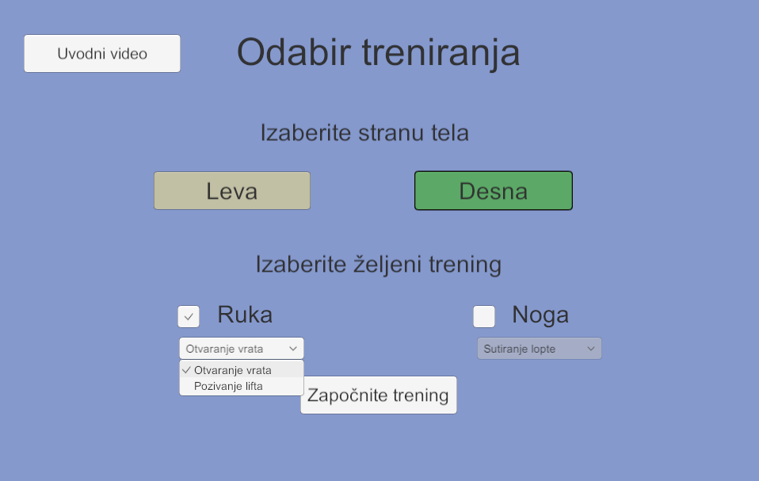
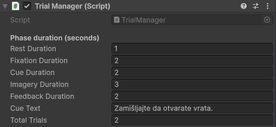
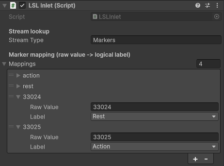
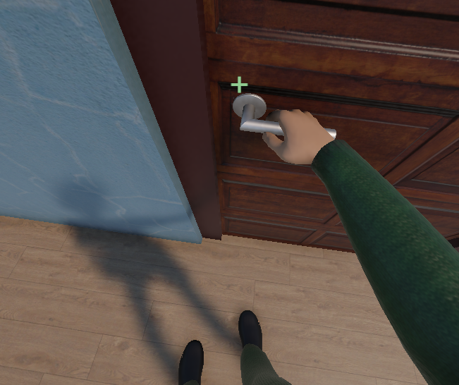
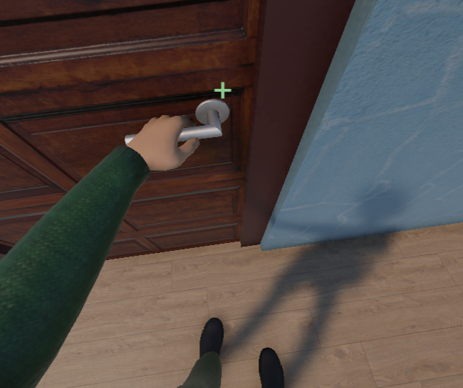
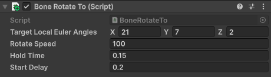

# BCI Stroke Rehabilitation using Unity

Unity + LSL + OpenViBE environment for motor imagery BCI-based rehabilitation of stroke patients.

*Bachelor's thesis project - School of Computing, Union University, Belgrade; course "Interfejs mozak-računar" (Brain-Computer Interface).*

## What it's for

This environment turns a classified EEG signal into a first-person rehabilitation training experience for stroke patients. It closes the sensorimotor loop used in motor imagery (MI) BCI rehab:

1. The patient imagines a movement (e.g. opening a door, kicking a ball).
2. An EEG classifier (in OpenViBE) decides whether the imagined movement was detected.
3. The decision is streamed to Unity in real time over LSL.
4. Unity plays back a matching visual + audio reaction from a first-person view, giving the patient feedback on their attempt.

Scenarios are based on simple, familiar everyday movements (shown to be more reliably detected in MI than unfamiliar ones), split by affected body side and body part:

- **Arm**: opening a door, calling an elevator
- **Leg**: kicking a ball, opening a trash can lid

Each session automatically logs trial-by-trial results (trial index, cue and imagery timing, raw marker, reaction time, hit/miss) to a CSV file for later analysis.

## Components

| Component | Role |
|---|---|
| **Unity environment** | URP Unity app: main menu, trial state machine, the 4 training scenarios, LSL listener, session CSV logger |
| **OpenViBE** | Acquires/simulates the EEG signal, runs the classifier, and streams the resulting decision as marker/stimulation events over LSL |
| **Lab Streaming Layer (LSL)** | Real-time middleware connecting OpenViBE's output stream to Unity's input |
| **EEG headset** *(optional)* | Only needed once you move past the simulated OpenViBE test scenario to a real acquisition pipeline |

Key scripts inside the Unity project:

- `MainMenuController.cs` - training selection menu (side, body part, scenario)
  

- `TrialManager.cs` - trial state machine: Rest → Fixation → Cue → Imagery → Feedback
  

- `LSLInlet.cs` - connects to the LSL stream and maps raw OpenViBE codes to `Action` / `Rest` / `Ignore`

- `MirrorDisplayController.cs` - mirrors the scene for left-side training

  → 
 

- `TrialUI.cs` / `AudioFeedback.cs` / `ToneGenerator.cs` - text, visual and audio feedback

- `SessionLogger.cs` - writes each trial's results to a CSV file
- `DoorReaction.cs`, `DoorHandleReaction.cs`, `ElevatorDoorReaction.cs`, `ButtonElevatorReaction.cs`, `TrashLidReaction.cs`, `BallReaction.cs`, `BoneRotateTo.cs` - per-scenario animation logic

 

## How to run it (Unity + OpenViBE + LSL together)

1. **Install prerequisites**
   - Unity Editor - version used: 6000.0.75f1
   - [OpenViBE](http://openvibe.inria.fr/) - version used: 3.4.0
   - [LSL4Unity](https://github.com/labstreaminglayer/LSL4Unity)

2. **Start OpenViBE and Unity**
   - Open OpenViBE Designer and load the scenario file (`.xml`) - either the simulated test scenario (Time Signal → `sin(x)` → Threshold Crossing Detector, which fakes classifier decisions without needing a real EEG device) or your real acquisition + classification scenario.
   - Open the project in Unity Hub.
   - Make sure the LSL Export block's stream name matches exactly what `LSLInlet.cs` expects on the Unity side - you can change this in the `LSLInlet` component inside BCIManager of each scene.
   - Run the scenario. OpenViBE will start streaming stimulation events over LSL.
   - Make sure to add the raw codes that are getting sent by OpenViBE to the mapping table on the `LSLInlet` component in the Unity Inspector, if they're not already added.

3. **Continue in Unity**
   - Open the **Main Menu** scene, and press Play (or run a build).
   - `LSLInlet.cs` tries to resolve the stream every frame; once connected you'll see a `LSLInlet: connected to stream ...` line in the Console.

4. **Run a training session**
   - In the in-app menu, pick the affected side and body part, choose a scenario from the dropdown, then click "**Započnite trening**".
   - The trial loop runs automatically for the configured number of trials, giving visual/audio feedback on each hit.

<video src="READMEImages/door_demo.mp4" controls width="400"></video>

5. **Check the results**
   - Each session writes `session_{yyyy-MM-dd_HH-mm-ss}.csv` to Unity's `Application.persistentDataPath`, with one row per trial (trial index, cue and imagery timing, raw marker, reaction time, hit/miss).

